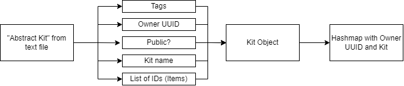

# Personal Kits
### Rework by MattMX

---

#### **About**
*Personal Kits* was originally a plugin created by [**Gatligator**](https://github.com/vance13) aimed at crystal practice servers. The plugin was good and functional, even providing a public kits system. However, the saving system was unoptimized, so I created a simple ID system for kits to use.

We can drastically reduce the kit file's size by using an ID system, where we can instead store a pre-made value's abstract ID instead of the "ItemStack" value. We can then take the stored IDs in a kit and decode them to their respective item that is predefined in the Kit Menu room.

For conciseness, we are storing small integers instead of a lot of strings; The bare minimum needed to save a kit.



---

#### **Installation**
Simply download the jar and drop it in your plugins folder. Feel free to look through any code or contact me for support.

---

#### Developers
For devlopers, you can clone this repository using **JitPack.io**!
> ##### Maven
> First add the *Jitpack Repository*.
> ```mvn
> <repositories>
>		<repository>
>		    <id>jitpack.io</id>
>		    <url>https://jitpack.io</url>
>		</repository>
>	</repositories>
>```
> Then add this project as a dependency
> ```mvn
> <dependency>
>	    <groupId>com.github.Matt-MX</groupId>
>	    <artifactId>PersonalKits</artifactId>
>	    <version>{tag}</version>
>	</dependency>
>```
> `{tag}` Being a tag you can select from [here](https://jitpack.io/#Matt-MX/PersonalKits/-SNAPSHOT).
---
> ##### Gradle
> First add the *Jitpack Repository*.
> ```gradle
>	allprojects {
>		repositories {
>			...
>			maven { url 'https://jitpack.io' }
>		}
>	}
>```
> Then add this project as a dependency
> ```gradle
>	dependencies {
>	        implementation 'com.github.Matt-MX:PersonalKits:Tag'
>	}
>```
> `{tag}` Being a tag you can select from [here](https://jitpack.io/#Matt-MX/PersonalKits/-SNAPSHOT).

---

Feel free to clone and make adjustments how you like, please leave _credit_ to me and Gatligator!

### [Website](https://www.mattmx.com/) | [Inferno](https://discord.gg/4UP6SgGGr3) | [Packs](https://www.discord.gg/packs)